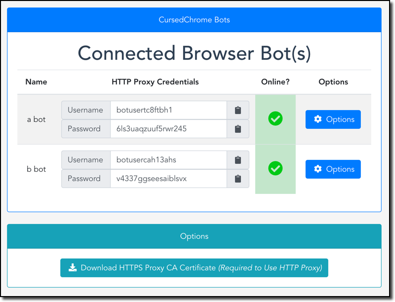
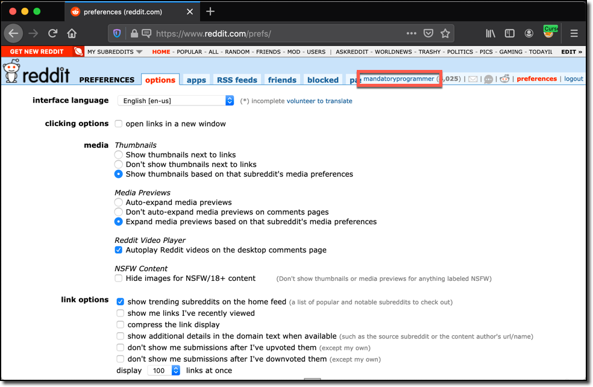
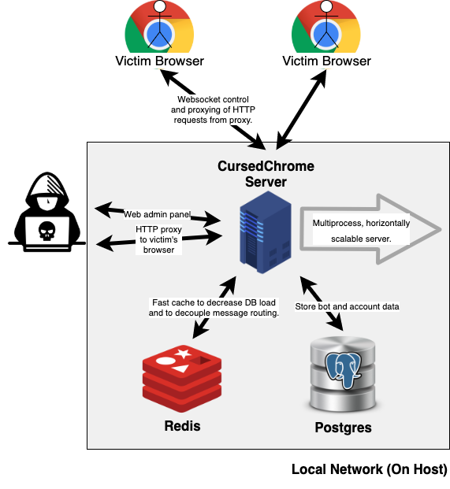

# CursedChrome

<p align="center">
	
</p>

### NOTICE

I thought this was clearly-implied, and that these disclaimers were redundant at this point, but:

> This is a tool written for *professional red teams*. It helps simulate an often unpracticed attack scenario involving malicious browser extensions. If you're planning on using this to maliciously spy on your friend/girlfriend/victims, let me know your address and intent and I'll gladly forward your message to your local LEO for your convenience.

### Blue Teams/Defenders/CorpSec
If you're on the blue team and wondering about ways to defend against this, take a look at my [ChromeGalvanizer project](https://github.com/mandatoryprogrammer/ChromeGalvanizer), which generates easy-to-install Chrome enterprise policies to defend against attacks like this. An easy-to-use hosted version is available [here](https://thehackerblog.com/galvanizer/).


# What is it?
A ([cursed](https://knowyourmeme.com/memes/cursed-image)) Chrome-extension implant that turns victim Chrome browsers into fully-functional HTTP proxies. By using the proxies this tool creates you can browse the web authenticated as your victim for all of their websites.

# Why make it?

More and more companies are moving toward the ["BeyondCorp"](https://en.wikipedia.org/wiki/BeyondCorp) model (e.g. no flat internal network, zero trust everything). This is usually implemented via a [reverse proxy/OAuth wall](https://github.com/bitly/oauth2_proxy) gating access to services, eliminating the need for a VPN. As access and tooling move towards being strictly available via the web browser, having a way to easily hijack and use victim's web sessions becomes an ever increasing necessity.

This is also especially useful for locked down orgs that make use of [Chrome OS](https://en.wikipedia.org/wiki/Chrome_OS) where traditional malware can't be used at all. It's also steathy, as all requests will have the appropriate source-IP, cookies, client-certificates, etc since it's being proxying directly through the victim's browser.

# Screenshots

## Web Admin Panel


## Browsing Websites Logged In as Victim (using Firefox with HTTP Proxy)


# (Rough) Infrastructure Diagram (`docker-compose` Used)



# Ports & Listening Interfaces

- `127.0.0.1:8080`: HTTP proxy server (using one of the credentials in the admin panel, you can auth to a specific victim's Chrome browser via this HTTP proxy server). You also need to install the generated CA available via the admin panel before using this.
- `127.0.0.1:4343`: Websocket server, used for communicating with victim Chrome instances to transfer HTTP requests for proxying and sending commands.
- `127.0.0.1:8118`: Admin web panel for viewing victim Chrome instances and getting HTTP proxy credentials.

**IMPORTANT**: If you are proxying through CursedChrome using **Firefox** please use [FoxyProxy](https://addons.mozilla.org/en-US/firefox/addon/foxyproxy-standard/). The built-in proxy support for Firefox has bugs in its implementation of authenticated HTTP proxies which will drive you to madness.

# Requirements

* [`docker`](https://docs.docker.com/get-docker/) and [`docker-compose`](https://docs.docker.com/compose/install/)
* Chrome web browser

# Installation & Setup (~5-10 Minutes)

## Step-By-Step Video Tutorial

If you're looking for an easy video walkthrough on setting up CursedChrome [check out this video](https://www.youtube.com/watch?v=cdSXdwa5trc) created by [@TurvSec](https://twitter.com/TurvSec).

If you'd prefer just reading the installation instructions, continue on.

## Setting Up the Backend

The backend is entirely dockerized and can be setup by running the following commands:

```
cd cursedchrome/
# Start up redis and Postgres containers in the background
docker-compose up -d redis db
# Start the CursedChrome backend
docker-compose up cursedchrome
```

Once you start up the backend you'll see an admin username and password printed to the console. You can log into the admin panel at `http://localhost:8118` using these credentials (you will be prompted to change your password upon logging in since the one printed to the console is likely logged). 

## Installing the CursedChrome CA for Proxying HTTPS

Once you have the backend setup, log in to the admin panel at `http://localhost:8118` (see above) and click the `Download HTTPS Proxy CA Certificate` button. This will download the generated CA file which is required in order to proxy HTTPS requests.

You will need to install this CA into your root store, the following are instructions for various OS/browsers:

* [OS X/Mac](https://www.sslsupportdesk.com/how-to-import-a-certificate-into-mac-os/)
* [Windows](https://www.sslsupportdesk.com/how-to-enable-or-disable-all-puposes-of-root-certificates-in-mmc/)
* [Linux](https://thomas-leister.de/en/how-to-import-ca-root-certificate/)
* [Firefox (any OS)](https://support.securly.com/hc/en-us/articles/360008547993-How-to-Install-Securly-s-SSL-Certificate-in-Firefox-on-Windows)

**IMPORTANT**: If you are proxying through CursedChrome using **Firefox** please use [FoxyProxy](https://addons.mozilla.org/en-US/firefox/addon/foxyproxy-standard/). The built-in proxy support for Firefox has bugs in its implementation of authenticated HTTP proxies which will drive you to madness.

## Setting Up the Example Chrome Extension Implant

To install the example chrome extension implant, do the following:

* Open up a Chrome web browser and navigate to `chrome://extensions`.
* Click the toggle in the top-right corner of the page labeled `Developer mode` to enable it.
* Click the `Load unpacked` button in the top-left corner of the page.
* Open the `extension/` folder inside of this repo folder.
* Once you've done so, the extension will be installed.

*Note:* You can debug the implant by clicking on the `background page` link for the text `Inspect views background page` under the `CursedChrome Implant` extension.

After you've install the extension it will show up on the admin control panel at `http://localhost:8118`.

## *Required for some sites*: Sync Cookies from Remote Victim

Some sites* require client-side (e.g. JavaScript utilized) cookies, for these sites you'll need to have the `cookies` permission in your implant's `manifest.json` in addition to the other required permissions.

If you have this permission declared, you can then use the Firefox/Chrome extension found in the `cookie-sync-extension/` folder. Load it into your web browser, enter the web panel URL (usually `http://localhost:8118`) and your bot's username/password and click the `Sync Remote Implant Cookies` to load all of your victim's cookies locally.

**NOTE:** For Firefox you will need to load the `manifest.json` file as a [temporary add on](https://blog.mozilla.org/addons/2015/12/23/loading-temporary-add-ons/).

*How magical!*

*Google Cloud Console is one of these sites - why Google? Why?*


# Production/Operational Usage

## Modifying Implant Extension

An example implant extension has been included under the `extension/` folder. This extension has the `extension/src/bg/background.js` file which has the extension-side of the implant that connects to the service via WebSocket to proxy requests through the victim's web browser.

The following [extension permissions](https://developer.chrome.com/extensions/api_index) are needed by the implant to operate:

```
"permissions": [
	"webRequest",
	"webRequestBlocking",
	"<all_urls>"
]
```

If you want to utilize the Cookie Sync extension to sync the remote browser's cookies with your own (required for some sites), ensure the permission `cookies` is also declared.

This code contains comments on how to modify it for a production setup. Basically doing the following:

* Minifying/stripping/uglifying the JavaScript code
* Modifying the WebSocket connection URI in the `initialize()` function to point to the host you've set up the backend on. By default it's set to `ws://localhost:4343` which will work with the out-of-the-box dev setup described in this README. 
* If you are using this in an attack scnario, you will also need to find where `redirect-hack.html` is referenced in `background.js` and replace instances with *an HTML file which already exists in the extension you're overriding*. Viewing the extension's source should make this easy.

In a real world attack, this extension code would be used in one of the following ways:

* Injected into an existing extension with proper permissions via Chrome debugging protocol.
* Hidden inside of another extension
* Force-installed via Chrome enterprise policy

These topics are outside of the scope of this README, but eventually will be covered separately.

## Further Notes on Production Deployments

* You will likely want to run an Nginx server with a valid HTTPS certificate doing a `proxy_pass` to the WebSocket server (running on `127.0.0.1:4343`). Then you'll have TLS-encrypted websocket traffic. If you go this route, you'll want to update your Websocket address from `ws://` -> `wss://`.
* For a more secure setup, don't expose the HTTP proxy & and admin panel to the Internet directly. Opt for SSL port-forwarding or using a bastion server to connect to it.
* For situations with a large number of victims/bots/implants running, you can horizontally scale out the CursedChrome server as wide as you need to. The socket handling is completely decoupled via `redis`, so it can suppose (theoretically) tens of thousands of concurrent clients. 

## Attributions

* The [AnyProxy source code](https://github.com/alibaba/anyproxy) was heavily modified and used for part of this project.
* The icon for this project was designed by [`monochromeye`](https://www.fiverr.com/monochromeye) on Fiverr (paid), if you're looking for graphic design work check her services out.
